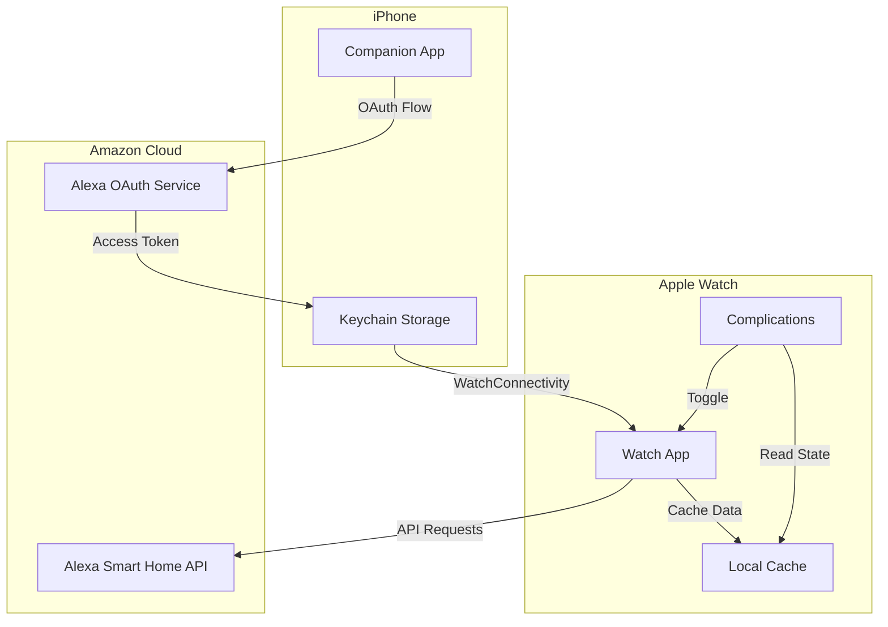
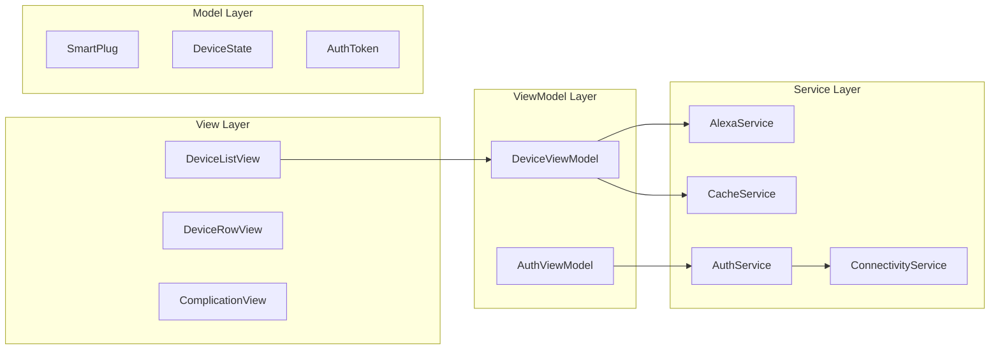

# Design Document: Alexa Watch Controller

## Overview

本设计文档描述了 Apple Watch Alexa 智能插座控制器的技术架构和实现方案。该应用由两部分组成：watchOS 应用（主应用）和 iOS 配套应用（用于 OAuth 认证）。应用使用 SwiftUI 构建，通过 WatchConnectivity 框架实现手表与手机之间的数据同步，并集成 Amazon Alexa Smart Home API 进行设备控制。

## Architecture

### 系统架构图



### 应用架构模式

采用 MVVM (Model-View-ViewModel) 架构模式：



## Components and Interfaces

### 1. Watch App 组件

#### DeviceListView
主界面，显示智能插座列表。

```swift
struct DeviceListView: View {
    @StateObject var viewModel: DeviceViewModel
    
    // 显示设备列表，支持下拉刷新
    // 处理空状态和错误状态
}
```

#### DeviceRowView
单个设备行视图。

```swift
struct DeviceRowView: View {
    let device: SmartPlug
    let onToggle: () -> Void
    
    // 显示设备名称、状态图标
    // 点击触发切换操作
}
```

#### ComplicationController
表盘小组件控制器。

```swift
class ComplicationController: NSObject, CLKComplicationDataSource {
    // 提供 Complication 数据
    // 处理点击事件
    // 更新显示状态
}
```

### 2. Companion App 组件

#### AuthenticationView
OAuth 认证界面。

```swift
struct AuthenticationView: View {
    @StateObject var viewModel: AuthViewModel
    
    // 显示登录按钮
    // 处理 OAuth 回调
    // 显示认证状态
}
```

### 3. Service Layer 接口

#### AlexaServiceProtocol

```swift
protocol AlexaServiceProtocol {
    func fetchDevices() async throws -> [SmartPlug]
    func toggleDevice(deviceId: String, newState: DeviceState) async throws -> SmartPlug
    func getDeviceState(deviceId: String) async throws -> DeviceState
}
```

#### AuthServiceProtocol

```swift
protocol AuthServiceProtocol {
    func initiateOAuth() async throws
    func handleCallback(url: URL) async throws -> AuthToken
    func refreshToken() async throws -> AuthToken
    func getStoredToken() -> AuthToken?
    func clearToken()
}
```

#### CacheServiceProtocol

```swift
protocol CacheServiceProtocol {
    func saveDevices(_ devices: [SmartPlug])
    func loadDevices() -> [SmartPlug]?
    func getCacheAge() -> TimeInterval?
    func clearCache()
}
```

#### ConnectivityServiceProtocol

```swift
protocol ConnectivityServiceProtocol {
    func sendToken(_ token: AuthToken)
    func receiveToken() -> AuthToken?
    var isReachable: Bool { get }
}
```

### 4. ViewModel Layer

#### DeviceViewModel

```swift
@MainActor
class DeviceViewModel: ObservableObject {
    @Published var devices: [SmartPlug] = []
    @Published var isLoading: Bool = false
    @Published var error: AppError?
    @Published var isUsingCache: Bool = false
    
    func loadDevices() async
    func toggleDevice(_ device: SmartPlug) async
    func refresh() async
}
```

#### AuthViewModel

```swift
@MainActor
class AuthViewModel: ObservableObject {
    @Published var isAuthenticated: Bool = false
    @Published var isLoading: Bool = false
    @Published var error: AppError?
    
    func login() async
    func logout()
    func checkAuthStatus()
}
```

## Data Models

### SmartPlug

```swift
struct SmartPlug: Identifiable, Codable, Equatable {
    let id: String              // Alexa 设备 ID
    let name: String            // 设备显示名称
    var state: DeviceState      // 当前状态
    let manufacturer: String?   // 制造商（可选）
    let model: String?          // 型号（可选）
    let lastUpdated: Date       // 最后更新时间
}
```

### DeviceState

```swift
enum DeviceState: String, Codable {
    case on = "ON"
    case off = "OFF"
    case unknown = "UNKNOWN"
    
    var isOn: Bool { self == .on }
    
    mutating func toggle() {
        self = self == .on ? .off : .on
    }
}
```

### AuthToken

```swift
struct AuthToken: Codable {
    let accessToken: String
    let refreshToken: String
    let expiresAt: Date
    let tokenType: String
    
    var isExpired: Bool {
        Date() >= expiresAt
    }
    
    var needsRefresh: Bool {
        Date() >= expiresAt.addingTimeInterval(-300) // 5分钟前刷新
    }
}
```

### AppError

```swift
enum AppError: Error, LocalizedError {
    case networkUnavailable
    case authenticationRequired
    case tokenExpired
    case apiError(String)
    case deviceNotFound
    case toggleFailed(String)
    
    var errorDescription: String? {
        switch self {
        case .networkUnavailable:
            return "无法连接网络，请检查网络设置"
        case .authenticationRequired:
            return "请在 iPhone 上完成登录"
        case .tokenExpired:
            return "登录已过期，请重新登录"
        case .apiError(let message):
            return "服务错误: \(message)"
        case .deviceNotFound:
            return "设备未找到"
        case .toggleFailed(let reason):
            return "操作失败: \(reason)"
        }
    }
}
```

### CachedDeviceList

```swift
struct CachedDeviceList: Codable {
    let devices: [SmartPlug]
    let cachedAt: Date
    
    var isStale: Bool {
        Date().timeIntervalSince(cachedAt) > 86400 // 24小时
    }
}
```

### ComplicationConfiguration

```swift
struct ComplicationConfiguration: Codable {
    let complicationId: String
    let deviceId: String
    let deviceName: String
}
```

## Correctness Properties

*A property is a characteristic or behavior that should hold true across all valid executions of a system-essentially, a formal statement about what the system should do. Properties serve as the bridge between human-readable specifications and machine-verifiable correctness guarantees.*

### Property 1: Token Storage Persistence

*For any* valid AuthToken received from OAuth callback, storing the token and then retrieving it should return an equivalent token with the same accessToken, refreshToken, and expiresAt values.

**Validates: Requirements 1.3**

### Property 2: Token Sync Round-Trip

*For any* AuthToken stored on the Companion_App, syncing via WatchConnectivity and receiving on Watch_App should produce an equivalent token.

**Validates: Requirements 1.4**

### Property 3: Expired Token Detection

*For any* AuthToken where expiresAt is in the past, the isExpired property should return true, and the app should redirect to re-authentication.

**Validates: Requirements 1.5, 7.2**

### Property 4: Device Fetch on Valid Auth

*For any* app launch state with a valid (non-expired) OAuth_Token, the app should initiate a device list fetch from the Alexa API.

**Validates: Requirements 2.1**

### Property 5: Device List Rendering Completeness

*For any* list of SmartPlug devices returned from the API, the rendered device list should contain all device names and their corresponding DeviceState values.

**Validates: Requirements 2.2**

### Property 6: Refresh Triggers Fetch

*For any* pull-to-refresh action on the device list, a new API request should be initiated to fetch the latest Device_List.

**Validates: Requirements 2.5**

### Property 7: Toggle State Inversion

*For any* SmartPlug with a known DeviceState (on or off), toggling the device should result in the opposite state being sent to the API and displayed upon success.

**Validates: Requirements 3.1, 3.3**

### Property 8: Toggle Failure Rollback

*For any* toggle operation that fails, the displayed DeviceState should revert to the original state before the toggle attempt.

**Validates: Requirements 3.4**

### Property 9: Loading State Consistency

*For any* async operation (device fetch or toggle), the isLoading state should be true while the operation is in progress and false after completion.

**Validates: Requirements 3.2, 4.5**

### Property 10: Cache Round-Trip

*For any* list of SmartPlug devices, saving to cache and then loading from cache should return an equivalent list with all device properties preserved.

**Validates: Requirements 5.1, 5.2**

### Property 11: Cache Staleness Detection

*For any* cached device list older than 24 hours, the isStale property should return true, and the app should indicate the data may be outdated.

**Validates: Requirements 5.3, 5.4**

### Property 12: Complication State Consistency

*For any* Complication configured with a SmartPlug, the displayed state should match the device's current DeviceState, and tapping should trigger a toggle operation for that device.

**Validates: Requirements 6.2, 6.3, 6.4**

### Property 13: Network Error Handling

*For any* API request that fails due to network unavailability, the app should display a connectivity error message.

**Validates: Requirements 7.1**

### Property 14: Error Logging

*For any* error that occurs in the app, the error details should be logged for debugging purposes.

**Validates: Requirements 7.3**

### Property 15: Error Message Guidance

*For any* error displayed to the user, the error message should contain actionable guidance (e.g., "请检查网络设置" or "请重新登录").

**Validates: Requirements 7.4**

## Error Handling

### 错误类型与处理策略

| 错误类型 | 触发条件 | 处理策略 | 用户提示 |
|---------|---------|---------|---------|
| NetworkUnavailable | 无网络连接 | 显示缓存数据，提示刷新 | "无法连接网络，显示缓存数据" |
| AuthenticationRequired | 无 Token | 引导至 iPhone 登录 | "请在 iPhone 上完成登录" |
| TokenExpired | Token 过期 | 尝试刷新，失败则重新登录 | "登录已过期，请重新登录" |
| APIError | API 返回错误 | 显示错误详情，提供重试 | "服务错误: [详情]" |
| DeviceNotFound | 设备不存在 | 刷新设备列表 | "设备未找到，请刷新列表" |
| ToggleFailed | 切换操作失败 | 回滚状态，提供重试 | "操作失败，请重试" |

### 错误恢复流程

```mermaid
flowchart TD
    A[发生错误] --> B{错误类型}
    B -->|网络错误| C[显示缓存数据]
    B -->|认证错误| D[引导重新登录]
    B -->|API错误| E[显示错误+重试按钮]
    B -->|操作错误| F[回滚状态+重试]
    
    C --> G[显示"数据可能过期"提示]
    D --> H[打开 iPhone Companion App]
    E --> I[用户点击重试]
    F --> J[用户点击重试]
    
    I --> K[重新发起请求]
    J --> K
```

### 日志记录

所有错误都应记录以下信息：
- 错误类型和描述
- 发生时间戳
- 相关上下文（设备 ID、操作类型等）
- 网络状态

## Testing Strategy

### 测试方法

本项目采用双重测试策略：

1. **单元测试 (Unit Tests)**: 验证特定示例、边界情况和错误条件
2. **属性测试 (Property-Based Tests)**: 验证跨所有输入的通用属性

两种测试方法互补，共同提供全面的测试覆盖。

### 属性测试配置

- **测试框架**: SwiftCheck (Swift 属性测试库)
- **最小迭代次数**: 每个属性测试至少 100 次迭代
- **标签格式**: `Feature: alexa-watch-controller, Property {number}: {property_text}`

### 测试分类

#### 属性测试 (Property-Based Tests)

| Property | 测试内容 | 生成器 |
|----------|---------|--------|
| Property 1 | Token 存储持久性 | 随机 AuthToken |
| Property 2 | Token 同步往返 | 随机 AuthToken |
| Property 3 | 过期 Token 检测 | 随机过期时间 |
| Property 7 | 切换状态反转 | 随机 SmartPlug + DeviceState |
| Property 8 | 切换失败回滚 | 随机 SmartPlug + 失败场景 |
| Property 10 | 缓存往返 | 随机 [SmartPlug] 列表 |
| Property 11 | 缓存过期检测 | 随机缓存时间 |
| Property 15 | 错误消息指导 | 随机 AppError |

#### 单元测试 (Unit Tests)

| 测试场景 | 测试内容 |
|---------|---------|
| 首次启动无 Token | 显示认证提示 |
| 空设备列表 | 显示"无设备"消息 |
| API 请求失败 | 显示错误+重试按钮 |
| Complication 配置 | 多设备选择界面 |
| Complication 操作失败 | 显示通知 |

### Mock 策略

```swift
// Mock Alexa Service
class MockAlexaService: AlexaServiceProtocol {
    var mockDevices: [SmartPlug] = []
    var shouldFail: Bool = false
    var failureError: AppError = .networkUnavailable
    
    func fetchDevices() async throws -> [SmartPlug] {
        if shouldFail { throw failureError }
        return mockDevices
    }
    
    func toggleDevice(deviceId: String, newState: DeviceState) async throws -> SmartPlug {
        if shouldFail { throw failureError }
        guard var device = mockDevices.first(where: { $0.id == deviceId }) else {
            throw AppError.deviceNotFound
        }
        device.state = newState
        return device
    }
}

// Mock Cache Service
class MockCacheService: CacheServiceProtocol {
    var storedDevices: [SmartPlug]?
    var cacheDate: Date?
    
    func saveDevices(_ devices: [SmartPlug]) {
        storedDevices = devices
        cacheDate = Date()
    }
    
    func loadDevices() -> [SmartPlug]? {
        return storedDevices
    }
    
    func getCacheAge() -> TimeInterval? {
        guard let date = cacheDate else { return nil }
        return Date().timeIntervalSince(date)
    }
}
```

### 测试数据生成器

```swift
// SwiftCheck Arbitrary 实现
extension SmartPlug: Arbitrary {
    public static var arbitrary: Gen<SmartPlug> {
        return Gen<SmartPlug>.compose { c in
            SmartPlug(
                id: c.generate(using: UUID.arbitrary.map { $0.uuidString }),
                name: c.generate(using: String.arbitrary.suchThat { !$0.isEmpty }),
                state: c.generate(),
                manufacturer: c.generate(using: String?.arbitrary),
                model: c.generate(using: String?.arbitrary),
                lastUpdated: c.generate(using: Date.arbitrary)
            )
        }
    }
}

extension DeviceState: Arbitrary {
    public static var arbitrary: Gen<DeviceState> {
        return Gen<DeviceState>.fromElements(of: [.on, .off])
    }
}

extension AuthToken: Arbitrary {
    public static var arbitrary: Gen<AuthToken> {
        return Gen<AuthToken>.compose { c in
            AuthToken(
                accessToken: c.generate(using: String.arbitrary.suchThat { $0.count > 10 }),
                refreshToken: c.generate(using: String.arbitrary.suchThat { $0.count > 10 }),
                expiresAt: c.generate(using: Date.arbitrary),
                tokenType: "Bearer"
            )
        }
    }
}
```
